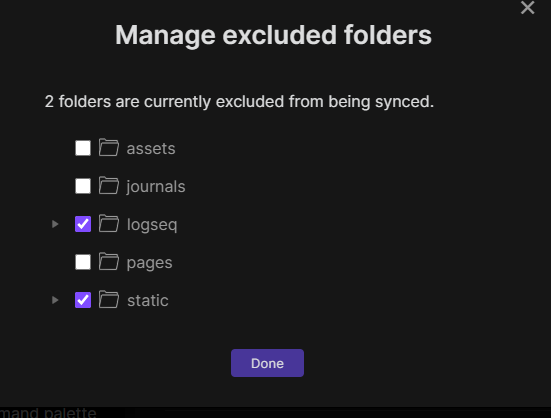

# Orans Projects
## how i got this repo working
### https://discuss.logseq.com/t/making-obsidian-play-nice-with-logseq/1185/4
## eden file
### :page-name-order "file"
### :journal/file-name-format "yyyyMMdd"
## obsidian side
### Daily Notes > date format > “YYYYMMDD” instead of “YYYY_MM_DD” like this tutorial says
-
# Obsidian sync with logsec git repo to play nicely with paid 'sync' obsidian feature
- 
# links
### https://discuss.logseq.com/t/making-obsidian-play-nice-with-logseq/1185/4

Logseq Publish is a tool that generates a fast, SEO-friendly, and scalable website from your Logseq content.
## Demo

https://eloquent-keller-6512b6.netlify.app/
## How to use

We plan to integrate the publish feature into the Logseq app and provide a one-click publish flow.

For now, you need to:

1. "Export as JSON" in the Logseq desktop app.
2. Clone this repo.
3. Copy the exported JSON to the root as data.json.
4. Copy the whole `assets` folder from the Logseq repo to the `public` folder.
5. Run `yarn && yarn dev` to start the site locally.
6. Run `yarn export` to generate the published static website in the folder `out`. You can deploy it to anywhere which supports static hosting, for example [Github Pages](https://guides.github.com/features/pages/)
# how to host using github pages & github actions for automation!

## Super Early!

We release Logseq Publish in its early stage to better involve the community in its development. Let's help make it better by:
- Use it with caution
- Contribute to missing features
- Report bugs (https://github.com/logseq/publish/issues)
- Send feature requests (https://discuss.logseq.com/c/feature-requests/7)
- Discuss on the Discord channel (https://discord.com/channels/725182569297215569/858995989801074708)
## Why

You want to share your Logseq knowledge graph with the world. While currently in Logseq you can "export public pages", which simply bundle the whole Logseq web app with your public pages and let you deploy them as a static website.

This approach has some limitations though:
- With all its rich features, the code size of Logseq can be big. Combining with the fact that it renders on the client using JavaScript, the exported pages can be slow on a poor network and is also not SEO friendly.
- You want different features and UI/UX for sharing than for content creation.
- You want to interpret your Logseq data in different ways than the Logseq app.
  
  Logseq Publish is a new approach for sharing your Logseq content more lightly.
## How does it work

1. Logseq exports a JSON file, which a tree structure consisting of various kinds of block types. (the sample `data.json` and `assets` are from the official Logseq documentation)
2. Logseq Publish provides code to transform the JSON data into structures more suitable for static rendering.
3. Logseq Publish provides React components for various Logseq block types and other UI elements. You can check them at `src/components`. Component names begin with "LS" are for Logseq-specific.
4. Logseq Publish utilizes [Next.js](https://nextjs.org/) to generate static HTML at build time.
## FAQ
### How to set the homepage?

By default the homepage is `Contents`. You can change the homepage by update the `homepage` key in `data.json`.
### What's the "Missing renderer for type:" warning message?

Logseq Publish does not implement all block types of Logseq. Since it's in early stage, if you the types that you need are missing, please send a feature request or (better!) consider contributing.
### How can I customize Logseq Publish?

There are a few options:
- Since the code is open-sourced, you can change the publishing experience by contribution or fork.
- Because the single source of truth is the exported JSON, you build your own publishing toolchain with the data. If some parts of Logseq Publish is useful for you, just copy it!. In fact, community members are already doing that (https://github.com/believer/devlog).
- (TODO) We will extrat a `publish.css` in which you can set CSS variables to customize the style, much like how you customize Logseq by editing `custom.css`.